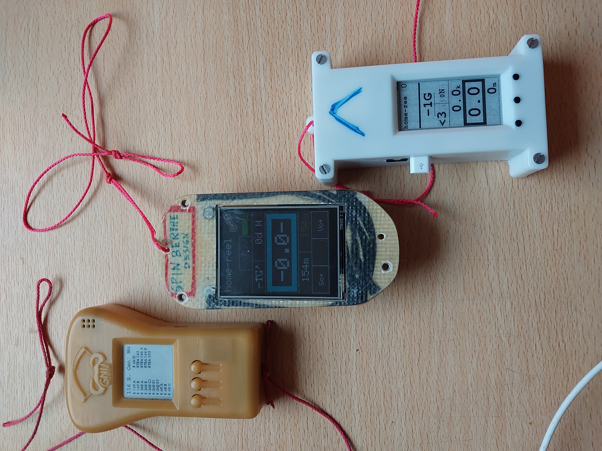

# Projets BertheVario/GnuVario, BertheVarioTac et BertheVario213. 
Vario Gps parapente developés en C/C++ sous Platformio/VisualStudioCode/Code::Blocks.

**BertheVario/GnuVario :**
- firmware pour GnuVario (https://prunkdump.github.io/GNUVario-TTGO-T5-website/0-Accueil.html)
- carte mere indisponible donc pour mise a jour vario existant uniquement.
- socle pour les fichiers commun des 3 vario.

**BertheVarioTac :**
- Vario a base de ESP32-2432S028 sans la coque.
- un peut lourd pour voler et moindre autonomie d'alimentation.

**BertheVario213 :**
- Vario et coque 3d a base de Lilygo GDEM0213T5BN.
- le plus abouti des 3 vario.

**Photo des 3 vario :**

**Logiciels annexes :**
- CompZoneAerienne : logiciel pour la creation du fichier de zone aerienne (TMA, CTR...). Visualisation des zones par fichier *.png et *.kml.
- GestHgt : logiciel pour les fichier *.hgt d'altitude sol (filtre france) et creation/verification checksum.
- IgcReader : logiciel pour relire succinctement un fichier igc (Z deco, Z attero ...) et le transformer en .kml pour googleearth.
- igc2kmz : logiciel python disponible sur le web pour creer un fichier .kmz googleearth, a partir d'un .igc (couleur fonction de Vz, altitude...)

zenodo :
https://doi.org/10.5281/zenodo.18722633
