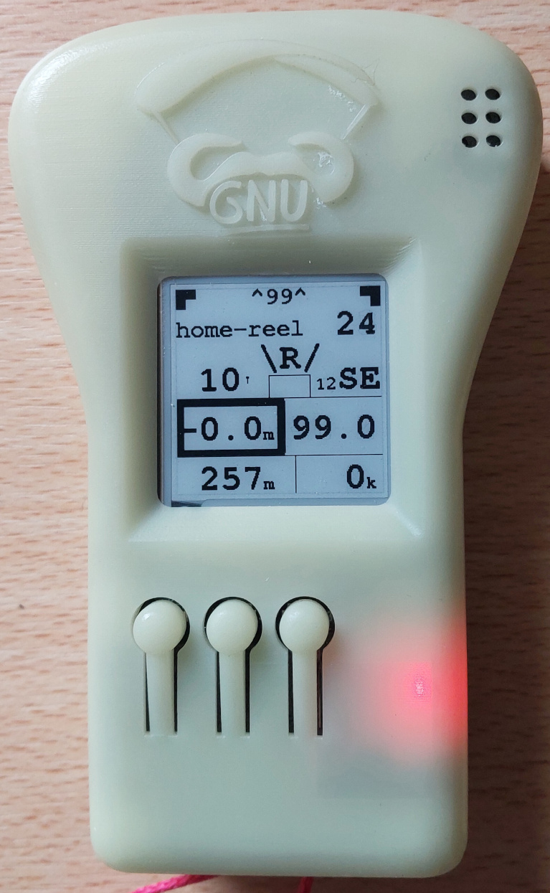

# Projet BertheVario
Firmware récent du GnuVario (https://prunkdump.github.io/GNUVario-TTGO-T5-website/).
- Code C++ Visual Studio/PlateformIO pour alti-vario gps parapente.
- Plateforme Espressif EPS32 Dev Module, TTGO T5, Lilygo v2.4, Arduino (processeur 32bits, bi-core 240mhz).

**Utilisation / description :**
- documentation utilisateur dans /doc
- projet PlateformIO dans /BertheVario
- editer/modifier avec codeblocs dans /BertheVarioCdb
- documentation developpeur dans ../../DoxyBertheVario avec le commande "doxygen Doxyfile.BertheVario" depuis /BertheVarioCdb
- generation de fichier reduit de zones aériennes avec /BVZoneAerienne depuis codeblocks/linux
- generation de fichier reduit de zones aériennes avec /BVZoneAerienneW10.exe executable binaire compilé pour Winwows 10
- firmware compilé pour une version "standard écran 1.54 Pcb2 de GnuVario" dans /firmware

   

**Pour les développeur :**
- voire la documentation doxygen generée.
- attention a bien positionner "#define GNU_VARIO_GRIS" dans BertheVario/src/BertheVario.h avant compilation pour un écran "standard".
- verifier les #define de debugage et en partitculier le #define SIMU_VOL qui simule un vol pour validation.
- fichier version.txt pour modification apportées aux differentes versions.
